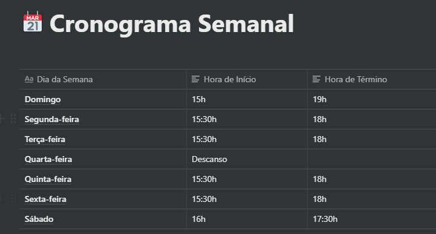
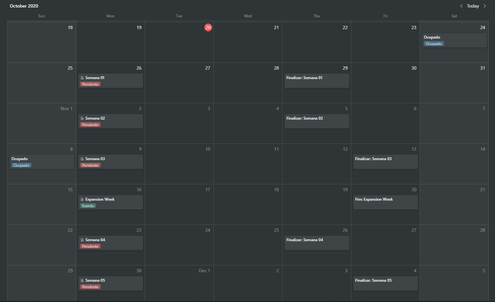

<h3 align="center">
    Desafio 1: Organizando meus estudos
</h3>

    <a href="#-sobre-o-desafio">Sobre o Desafio</a>&nbsp;&nbsp;&nbsp;|&nbsp;&nbsp;&nbsp;
    <a href="#-resultado">Resultado</a>&nbsp;&nbsp;&nbsp;

## 🚀 Sobre o Desafio

Nesse desafio, tive de planejar os meus estudos durante o Bootcamp.

Para isso, criei um cronograma que irá se adaptar ao meu tempo e ritmo.

Foi definido meu horário de estudo, criando tarefas que estarão atreladas a um calendário, para me mantar com foco e sempre alinhado com meus objetivos!

## ✅ Resultado

O resultado do meu cronograma semanal foi:

    

Já o resultado do meu cronograma de conteúdo foi:

    

---

Feito com 💜 por Carlos Eduardo.