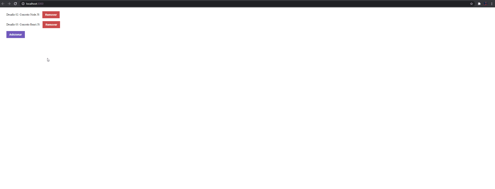
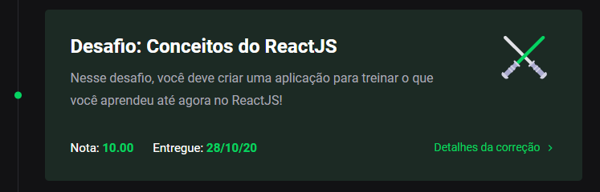

<h3 align="center">
    Desafio 03: Conceitos do React.JS
</h3>

<p align="center">
    <a href="#-sobre-o-desafio">Sobre o Desafio</a>&nbsp;&nbsp;&nbsp;|&nbsp;&nbsp;&nbsp;
    <a href="#-nota">Nota</a>&nbsp;&nbsp;&nbsp;|&nbsp;&nbsp;&nbsp;
    <a href="#-instalação">Instalação</a>&nbsp;&nbsp;&nbsp;|&nbsp;&nbsp;&nbsp;
    <a href="#-licença">Licença</a>
</p>

<p align="center">
  

  

  
</p>

## 🚀 Sobre o Desafio

Nesse desafio, o objetivo foi desenvolver uma aplicação que irá armazenar repositórios do meu portfólio, utilizando a API já desenvolvida no último desafio de back-end (02 - Conceitos de Node.JS), utilizando o Node.js.

Para isso, foi desenvolvido um front-end SIMPLES que envia requisiçes HTTP para o back-end, através do <http://localhost:3333/>. Ao clicar no botão "Adicionar", o front-end envia uma requisação POST contendo `title, url e techs` com valores temporários, já que ainda não possuimos um formulário. Já ao clicar no botão "Remover", o front-end envia uma requisição DELETE contendo o ID do repositório.

Neste momento, ainda não conseguimos adicionar repositórios com valores específicos, atualizar o repositório e dar "like" no repositório, os mesmos ainda serão adicionados.

<p align="center">
  
</p>

## 🧾 Nota

A nota recebida nesse desafio foi:

<p align="center">
  
</p>

## 💿 Instalação

Para executar este projeto, você deve possuir o Node e o Yarn instalado para configurar todas as dependências.

```
- Clone o repositório:
$ git clone https://github.com/carlosmfreitas2409/bootcamp-gostack-desafios

- Entre no diretório:
$ cd desafio-conceitos-reactjs

- Para instalar as dependências:
$ yarn

- Execute a aplicação:
$ yarn start

- O site irá abrir automaticamente, ou então:
http://localhost:3333/
```

## 📝 Licença

Esse projeto está sob a licença MIT. Veja o arquivo [LICENSE](https://github.com/carlosmfreitas2409/bootcamp-gostack-desafios/blob/master/LICENSE).

---

Feito com 💜 por Carlos Eduardo.
