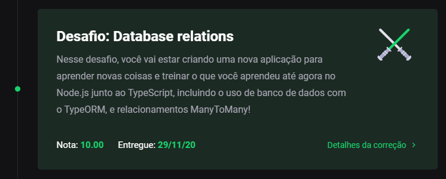

<h3 align="center">
    Desafio 09: Relacionamentos com banco de dados no Node.JS
</h3>

<p align="center">
    <a href="#-sobre-o-desafio">Sobre o Desafio</a>&nbsp;&nbsp;&nbsp;|&nbsp;&nbsp;&nbsp;
    <a href="#-nota">Nota</a>&nbsp;&nbsp;&nbsp;|&nbsp;&nbsp;&nbsp;
    <a href="#-rotas-do-backend">Rotas Backend</a>&nbsp;&nbsp;&nbsp;|&nbsp;&nbsp;&nbsp;
    <a href="#-instalação">Instalação</a>&nbsp;&nbsp;&nbsp;|&nbsp;&nbsp;&nbsp;
    <a href="#-licença">Licença</a>
</p>

<p align="center">
  

  

  
</p>

## 🚀 Sobre o Desafio

Nesse desafio, o objetivo foi criar uma nova aplicação, treinando o que eu aprendi até agora no Node.js junto ao TypeScript, incluindo o uso de banco de dados com o TypeORM, e relacionamentos ManyToMany.

Essa será uma aplicação que deve permitir a criação de clientes, produtos e pedidos, onde o cliente pode gerar novos pedidos de compra de certos produtos, como um pequeno e-commerce.

## 🧾 Nota

A nota recebida nesse desafio foi:

<p align="center">
  
</p>

## 🍃 Rotas do Backend

Resource URI              | Método HTTP | Finalidade
------------------------- | ----------- | -------
/customers                | POST        | Cadastra um novo cliente
/products                 | POST        | Cadasta um novo produto
/orders                   | POST        | Realiza um novo pedido
/orders/:id               | GET         | Informações de um produto específico

### Exemplo

Caso eu chame a rota `POST /products` repassando `{ "name": 'Launchpad PRO', "price": 1999.99, "quantity": 10 }`, deve me retornar, como produto criado:

```json
{
  "id": "ID-DA-TRANSAÇÃO",
  "name": "Launchpad PRO",
  "price": 1999.99,
  "quantity": 10,
  "created_at": "2020-11-29T18:47:38.957Z",
  "updated_at": "2020-11-29T18:47:38.957Z"
}
```

## 💿 Instalação

Para executar este projeto, você deve possuir o Node e o Yarn instalado para configurar todas as dependências.

```
- Clone o repositório:
$ git clone https://github.com/carlosmfreitas2409/bootcamp-gostack-desafios

- Entre no diretório:
$ cd desafio-database-relations

- Para instalar as dependências:
$ yarn

- Execute a aplicação:
$ yarn dev:server
```

## 📝 Licença

Esse projeto está sob a licença MIT. Veja o arquivo [LICENSE](https://github.com/carlosmfreitas2409/bootcamp-gostack-desafios/blob/master/LICENSE).

---

Feito com 💜 por Carlos Eduardo.
