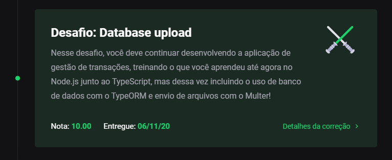

<h3 align="center">
    Desafio 06: Banco de dados e upload de arquivos no Node.js
</h3>

<p align="center">
    <a href="#-sobre-o-desafio">Sobre o Desafio</a>&nbsp;&nbsp;&nbsp;|&nbsp;&nbsp;&nbsp;
    <a href="#-nota">Nota</a>&nbsp;&nbsp;&nbsp;|&nbsp;&nbsp;&nbsp;
    <a href="#-rotas-do-backend">Rotas Backend</a>&nbsp;&nbsp;&nbsp;|&nbsp;&nbsp;&nbsp;
    <a href="#-instalação">Instalação</a>&nbsp;&nbsp;&nbsp;|&nbsp;&nbsp;&nbsp;
    <a href="#-licença">Licença</a>
</p>

<p align="center">
  

  

  
</p>

## 🚀 Sobre o Desafio

Nesse desafio, o objetivo foi continuar desenvolvendo a aplicação de gestão de transações, treinando o que eu aprendi até agora no Node.js junto ao TypeScript, mas dessa vez incluindo o uso de banco de dados com o TypeORM e envio de arquivos com o Multer!


Esta aplicação permite armazenar transações financeiras de entrada e saída e, permitir o cadastro e a listagem dessas transações, além de permitir a criação de novos registros no banco de dados a partir do envio de um arquivo csv.

## 🧾 Nota

A nota recebida nesse desafio foi:

<p align="center">
  
</p>

## 🍃 Rotas do Backend

Resource URI              | Método HTTP | Finalidade
------------------------- | ----------- | -------
/transactions             | GET         | Lista de transições
/transactions             | POST        | Cadastra uma nova transação
/transactions/:id         | DELETE      | Deleta uma transação
/transactions/import      | POST        | Adiciona transições a partir do upload de um arquivo CSV

### Exemplo

Caso eu chame a rota `POST /transactions` repassando `{ "title": 'Salário', "value": 2000, "type": 'income', "category": 'Salários' }`, minha lista de transações deve ficar da seguinte maneira:

```json
{
  "transactions": [
    {
      "id": "ID-DA-TRANSAÇÃO",
      "title": "Salário",
      "value": 2000,
      "type": "income"
    }
  ],
  "balance": {
    "income": 2000,
    "outcome": 0,
    "total": 2000
  }
}
```

## 💿 Instalação

Para executar este projeto, você deve possuir o Node e o Yarn instalado para configurar todas as dependências.

```
- Clone o repositório:
$ git clone https://github.com/carlosmfreitas2409/bootcamp-gostack-desafios

- Entre no diretório:
$ cd desafio-database-upload

- Para instalar as dependências:
$ yarn

- Execute a aplicação:
$ yarn dev:server

- Open your browser in:
http://localhost:3333/
```

## 📝 Licença

Esse projeto está sob a licença MIT. Veja o arquivo [LICENSE](https://github.com/carlosmfreitas2409/bootcamp-gostack-desafios/blob/master/LICENSE).

---

Feito com 💜 por Carlos Eduardo.
