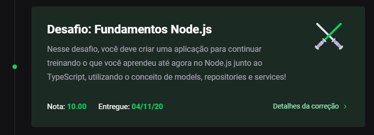

<h3 align="center">
    Desafio 05: Fundamentos do Node.JS (Primeiro projeto Node.JS)
</h3>

<p align="center">
    <a href="#-sobre-o-desafio">Sobre o Desafio</a>&nbsp;&nbsp;&nbsp;|&nbsp;&nbsp;&nbsp;
    <a href="#-nota">Nota</a>&nbsp;&nbsp;&nbsp;|&nbsp;&nbsp;&nbsp;
    <a href="#-rotas-do-backend">Rotas Backend</a>&nbsp;&nbsp;&nbsp;|&nbsp;&nbsp;&nbsp;
    <a href="#-instalação">Instalação</a>&nbsp;&nbsp;&nbsp;|&nbsp;&nbsp;&nbsp;
    <a href="#-licença">Licença</a>
</p>

<p align="center">
  

  

  
</p>

## 🚀 Sobre o Desafio

Nesse desafio, o objetivo foi desenvolver uma API para continuar treinando o que aprendi até agora no Node.JS junto ao TypeScript, utilizando o conceito de models, repositories e services.

Esta aplicação permite armazenar transações financeiras de entrada e saída, além do cadastro e a listagem dessas transações.

## 🧾 Nota

A nota recebida nesse desafio foi:

<p align="center">
  
</p>

## 🍃 Rotas do Backend

Resource URI              | Método HTTP | Finalidade
------------------------- | ----------- | -------
/transactions             | GET         | Lista de transações
/transactions             | POST        | Cadastra uma nova transação

### Exemplo

Caso eu chame a rota `POST /transactions` repassando `{ "title": 'Salário', "value": 2000, "type": 'income' }`, minha lista de transações deve ficar da seguinte maneira:

```json
{
  "transactions": [
    {
      "id": "ID-DA-TRANSAÇÃO",
      "title": "Salário",
      "value": 2000,
      "type": "income"
    }
  ],
  "balance": {
    "income": 2000,
    "outcome": 0,
    "total": 2000
  }
}
```
**OBS:** Dentro de balance, o income é a soma de todos os valores das transações com `type` income. O outcome é a soma de todos os valores das transações com `type` outcome, e o total é o valor de `income - outcome`.

## 💿 Instalação

Para executar este projeto, você deve possuir o Node e o Yarn instalado para configurar todas as dependências.

```
- Clone o repositório:
$ git clone https://github.com/carlosmfreitas2409/bootcamp-gostack-desafios

- Entre no diretório:
$ cd desafio-fundamentos-nodejs

- Para instalar as dependências:
$ yarn

- Execute a aplicação:
$ yarn dev:server

- Open your browser in:
http://localhost:3333/
```

## 📝 Licença

Esse projeto está sob a licença MIT. Veja o arquivo [LICENSE](https://github.com/carlosmfreitas2409/bootcamp-gostack-desafios/blob/master/LICENSE).

---

Feito com 💜 por Carlos Eduardo.
