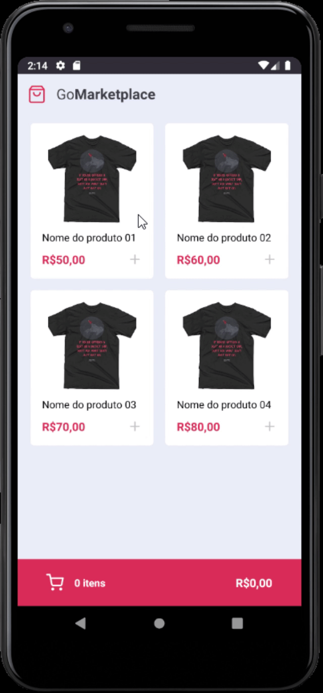
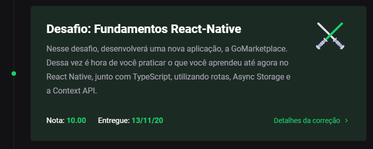

<h3 align="center">
  Desafio 08: Fundamentos do React Native (GoMarketplace)
</h3>

<p align="center">
  <a href="#-sobre-o-desafio">Sobre o Desafio</a>&nbsp;&nbsp;&nbsp;|&nbsp;&nbsp;&nbsp;
  <a href="#-nota">Nota</a>&nbsp;&nbsp;&nbsp;|&nbsp;&nbsp;&nbsp;
  <a href="#-instalação">Instalação</a>&nbsp;&nbsp;&nbsp;|&nbsp;&nbsp;&nbsp;
  <a href="#-licença">Licença</a>
</p>

<p align="center">
  

  

  
</p>

## 🚀 Sobre o Desafio

Nesse desafio, o objetivo foi desenvolver uma nova aplicação, a GoMarketplace. Para então, praticar o que eu aprendi até agora no React Native junto com TypeScript, utilizando rotas, Async Storage e a Context API.

Essa aplicação se conecta com uma Fake API, para prover dados sobre os produtos.

<p align="center">
  
</p>

## 🧾 Nota

A nota recebida nesse desafio foi:

<p align="center">
  
</p>

## 💿 Instalação

Para executar este projeto, você deve possuir o Node e o Yarn instalado para configurar todas as dependências.

```
- Clone o repositório:
$ git clone https://github.com/carlosmfreitas2409/bootcamp-gostack-desafios

- Entre no diretório:
$ cd desafio-fundamentos-react-native

- Para instalar as dependências:
$ yarn

- Execute a aplicação:
$ yarn start
$ yarn json-server server.json -p 3333

- Abra seu Android/IOS emulator
```

## 📝 Licença

Esse projeto está sob a licença MIT. Veja o arquivo [LICENSE](https://github.com/carlosmfreitas2409/bootcamp-gostack-desafios/blob/master/LICENSE).

---

Feito com 💜 por Carlos Eduardo.
