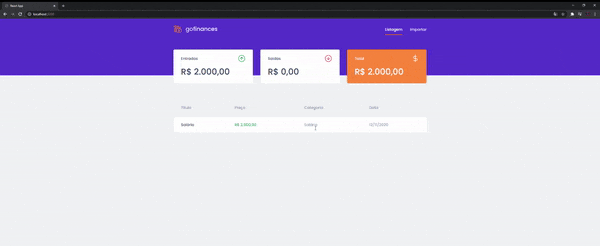
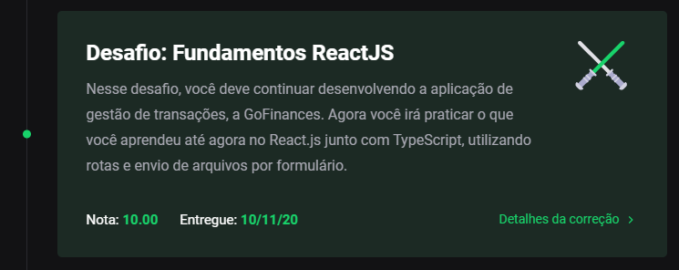

<h3 align="center">
    Desafio 07: Fundamentos do React.JS (GoFinances Web)
</h3>

<p align="center">
    <a href="#-sobre-o-desafio">Sobre o Desafio</a>&nbsp;&nbsp;&nbsp;|&nbsp;&nbsp;&nbsp;
    <a href="#-nota">Nota</a>&nbsp;&nbsp;&nbsp;|&nbsp;&nbsp;&nbsp;
    <a href="#-instalação">Instalação</a>&nbsp;&nbsp;&nbsp;|&nbsp;&nbsp;&nbsp;
    <a href="#-licença">Licença</a>
</p>

<p align="center">
  

  

  
</p>

## 🚀 Sobre o Desafio

Nesse desafio, o objetivo foi continuar desenvolvendo a aplicação de gestão de transações, a GoFinances, treinando o que eu aprendi até agora no React.js junto com TypeScript, utilizando rotas e envio de arquivos por formulário.

Essa aplicação se conecta com ao meu backend do <a href="https://github.com/carlosmfreitas2409/bootcamp-gostack-desafios/tree/master/desafio-database-upload">Desafio 06</a>, onde exibe as transações criadas e permite a importação de um arquivo CSV para gerar novos registros no banco de dados.

<p align="center">
  
</p>

## 🧾 Nota

A nota recebida nesse desafio foi:

<p align="center">
  
</p>

## 💿 Instalação

Para executar este projeto, você deve possuir o Node e o Yarn instalado para configurar todas as dependências.

```
- Clone o repositório:
$ git clone https://github.com/carlosmfreitas2409/bootcamp-gostack-desafios

- Entre no diretório:
$ cd desafio-fundamentos-reactjs

- Para instalar as dependências:
$ yarn

- Execute a aplicação:
$ yarn start

- O site irá abrir automaticamente, ou então:
http://localhost:3000/
```

## 📝 Licença

Esse projeto está sob a licença MIT. Veja o arquivo [LICENSE](https://github.com/carlosmfreitas2409/bootcamp-gostack-desafios/blob/master/LICENSE).

---

Feito com 💜 por Carlos Eduardo.
